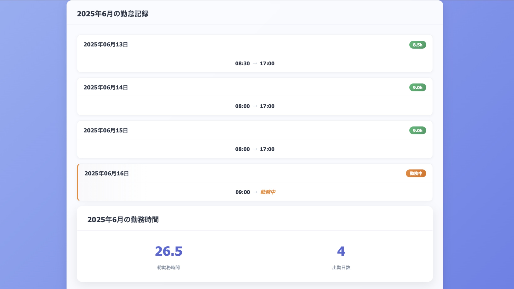

# ポートフォリオ ― 勤怠管理システム（Ruby on Rails + Docker 　+ AWS）

ご覧いただきありがとうございます。

このリポジトリは、Ruby on Rails + Docker + AWS を活用し、
バックエンド開発の基礎と実践力を体系的に身につけることを目的として作成しました。
その成果をポートフォリオとしてまとめています。

---

## 🚩 デモ・スクリーンショット

| ログイン画面                                | 新規登録画面                               |
| ------------------------------------------- | ------------------------------------------ |
|   |  |
| ダッシュボード                              | ダッシュボード(勤怠確認画面)               |
|  |   |
| 出勤画面                                    | 退勤画面                                   |
|      |    |
| 詳細画面(退勤前)                            | 詳細画面(退勤済み)                         |
|          |        |

## ⚖️ インフラ構成図


## 特徴・主な機能

- **勤怠打刻**：ユーザーは出勤・退勤時刻を記録できます（重複打刻防止機能付き）
- **勤怠履歴の確認**：記録した勤怠データを一覧・詳細で表示できます
- **ユーザー認証**：Devise を用いた新規登録・ログイン・ログアウト機能
- **レスポンシブデザイン**：スマートフォン／PC 両対応の UI
- **フラッシュメッセージ**：アクションの成否を通知する機能
- **リアルタイム時計**：Stimulus コントローラによるリアルタイム時計表示
- **テスト**：RSpec によるモデル・リクエストテストを実装
- **Docker 対応**：開発・本番環境構築の自動化
- **CI/CD**：GitHub Actions による自動テスト・デプロイ
- **AWS Fargate 対応**：コンテナオーケストレーションサービスへのデプロイ設定

## 使用技術

- **バックエンド**
  - Ruby 3.2.2
  - Rails 7.1.5
  - PostgreSQL
  - Devise（認証）
- **フロントエンド**
  - Stimulus
  - Turbo
  - SCSS/CSS
- **インフラ・開発環境**
  - Docker / Docker Compose
  - GitHub Actions（CI/CD）
  - AWS（ECS Fargate、ECR、RDS、Parameter Store）
- **テスト**
  - RSpec

## ディレクトリ構成（一部抜粋）

- `app/models/`：User、Attendance モデル
- `app/controllers/`：AttendancesController、認証関連コントローラ
- `app/views/`：勤怠記録・ユーザー関連ビュー
- `app/javascript/controllers/`：Stimulus コントローラ（時計表示など）
- `config/`：アプリケーション設定
- `spec/`：RSpec によるテストコード
- `Dockerfile`、`docker-compose.yml`：Docker 環境設定
- `.github/workflows/`：GitHub Actions CI/CD 設定

## セットアップ・起動方法

1. リポジトリをクローン

   ```bash
   git clone https://github.com/yourusername/rails_docker_dev_v1.git
   cd rails_docker_dev_v1
   ```

2. Docker Compose でコンテナ起動

   ```bash
   docker compose up --build
   ```

3. データベース作成・マイグレーション

   ```bash
   docker compose run --rm web rails db:create db:migrate db:seed
   ```

4. ブラウザで `http://localhost:3000` へアクセス

## テスト実行

```bash
docker compose run --rm web bundle exec rspec
```

## デプロイ方法

本アプリケーションは AWS Fargate にデプロイする設定が含まれています。

1. 必要な AWS リソースをセットアップ（詳細は DEPLOYMENT_TROUBLESHOOTING.md を参照）
2. GitHub Actions の環境変数を設定
3. main ブランチにプッシュすると自動デプロイ

## アピールポイント

- **本番環境を考慮した設計**：開発から本番まで一貫した Docker 環境
- **セキュリティ対策**：Parameter Store による秘匿情報管理
- **健全なコード品質**：テストコード、コード規約の遵守
- **実用的な機能**：勤怠管理に必要な基本機能を網羅
- **CI/CD パイプライン**：自動テスト・デプロイの実装

## 開発環境

- Docker 環境（詳細は`docker-compose.yml`参照）
- PostgreSQL データベース
- 各種 Rails コマンドは `docker compose run --rm web [command]` の形式で実行

## ライセンス

MIT

---

ご覧いただきありがとうございます。本システムに関してご質問等ありましたらお気軽にお問い合わせください。
